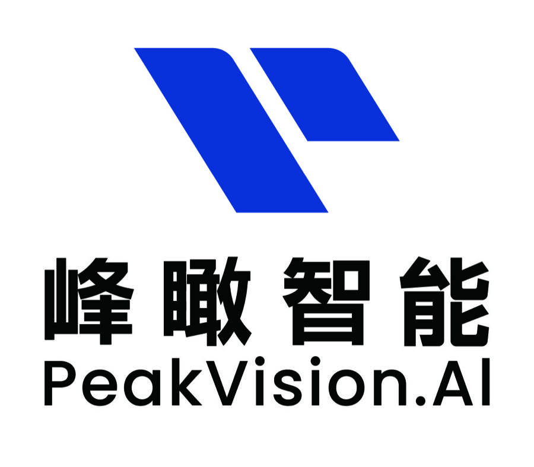

<p align="center">
  
</p>

<h1 align="center">PeakVisionOS SDK</h1>

<p align="center">
  面向端侧智能体的本地开发工具包与控制面客户端
</p>

[](https://pypi.org/project/peakvisionos-sdk/)
[](https://github.com/PeakVisionAI/PeakVisionOS-SDK/actions/workflows/ci.yml)
[](LICENSE)
[](https://github.com/PeakVisionAI/PeakVisionOS-SDK/stargazers)
[](https://github.com/PeakVisionAI/PeakVisionOS-SDK/fork)
[](https://github.com/PeakVisionAI/PeakVisionOS-SDK/watchers)


PeakVisionOS SDK 是面向端侧（桌面） Agent 的 Python 开发工具包和控制面客户端。它让开发者在自己的电脑上编写、测试和打包 Agent，再把 Agent 安装到运行 PeakVisionOS 的 Ubuntu 节点上，调用本地模型、记忆、语义文件和系统感知能力。

PeakVisionOS SDK 不是一个新的大模型框架，也不是操作系统镜像。它连接 PeakVisionOS 提供的系统能力，并把本地 Unix Socket、Agent 运行时、Remote Gateway 和 Harness 工具契约封装成稳定的开发接口。

## 能做什么

- 在没有 GPU 或真实节点时，用 Mock 完成 Agent 代码和协议开发。
- 在端侧节点调用 `agentd`、`inferd`、`memoryd` 和 `fsd` 四大系统原语。
- 使用 Context Gateway 将记忆、语义文件和历史信息装配到有限的上下文窗口。
- 通过 Agent Manifest 声明最小权限，校验、打包、安装和升级 Agent。
- 通过 Remote Gateway 管理节点、Workspace、Task、Run、日志和事件。
- 将 DeepSeek Harness、LangGraph 或自研 Harness 接入统一的工具和事件契约。
- 使用标准库 Python 客户端构建适合船舶设计、服装设计、机床运维、政务等场景的端侧 Agent。

## 核心概念

### 本地系统原语

运行在 PeakVisionOS 节点上的基础能力单元：

| 原语 | 作用 |
| --- | --- |
| `agentd` | 系统感知、主机状态和进程信息 |
| `inferd` | 本地模型发现、推理、嵌入和硬件后端适配 |
| `memoryd` | 长期记忆、版本和语义召回 |
| `fsd` | 内容寻址存储和语义文件检索 |

`agentrund` 负责 Agent 生命周期和能力注入，`ctxd` 负责上下文装配；它们是系统服务，不属于四大原语。SDK 通过 Unix Socket 访问这些能力，默认遵循节点的权限和资源策略。

### Remote Gateway

开发机、GUI 和 CI 通过 HTTPS 访问 Remote Gateway，管理节点上的 Workspace、Task、Run、日志和事件。Gateway 是控制面入口，不把内部 Unix Socket 协议直接暴露为公网 API。

### Manifest 与 Harness

Manifest 描述 Agent 的入口、版本和最小原语权限。Harness Adapter 将规划、工具调用、人工审批、超时、事件记录和结果校验接入 PeakVisionOS 的稳定契约。

## 快速开始

### 安装

要求 Python 3.8 或更高版本。

```bash
python -m venv .venv
source .venv/bin/activate       # Windows PowerShell: .venv\Scripts\Activate.ps1
python -m pip install --upgrade pip
python -m pip install peakvisionos-sdk
```

Python 导入名是 `pvos`。当前公开发布主线是 Python/PyPI；`typescript/` 目录中的 TypeScript 客户端保留用于源码级 Remote Gateway 开发，暂不作为 NPM 安装入口。

### 第一个本地 Agent

没有真实 PeakVisionOS 节点时，使用内置 Mock 验证调用链：

```python
import pvos

with pvos.PrimitiveMock():
    aos = pvos.PeakVisionOS(caller="hello-agent")
    print(aos.system())
    print(aos.chat("用一句话说明端侧推理的价值"))
    aos.memory_write("用户偏好简洁的运行报告")
    print(aos.memory_recall("用户偏好", top_k=3))
```

`PrimitiveMock` 只验证请求格式、返回结构和错误处理，不模拟真实模型、GPU、权限隔离或安全边界。连接真实节点时，去掉 `PrimitiveMock` 并确保对应 PeakVisionOS 服务已启动。

### 管理一个 Agent 包

```bash
pvos new my-agent
pvos inspect my-agent
pvos test my-agent
pvos package my-agent -o my-agent.agent.tgz
```

把生成的包复制到 PeakVisionOS 节点后：

```bash
pvos install my-agent.agent.tgz --root /etc/agent-os/agents
agentrun spawn my-agent
agentrun status my-agent
agentrun logs my-agent
```

安装器会校验 Manifest，拒绝路径穿越、链接和特殊文件，并在部署失败时恢复上一版本。生产部署应额外启用摘要或签名校验，并定义停止、升级和回滚策略。

### 连接 Remote Gateway

```python
from pvos import GatewayClient

client = GatewayClient(
    endpoint="https://gateway.example/gateway/v1/nodes/node-1/api/v1",
    token="<short-lived-token>",
)

print(client.health())
run = client.create_run("my-agent", idempotency_key="demo-2026-001")
print(client.run(run["run_id"]))
for event in client.iter_events(max_pages=1):
    print(event)
```

真实环境请使用 HTTPS、短期令牌和服务端 RBAC；不要把令牌写入 Agent 源码、Manifest 或日志。

## 示例

仓库中的示例可以先在开发机上做语法、Manifest 和打包检查，再安装到真实节点：

| 示例 | 展示内容 | 最小权限 |
| --- | --- | --- |
| [knowledge-docs-agent](examples/knowledge-docs-agent/) | 本地文档摄取、语义检索和摘要 | `agent,infer,fs` |
| [edge-coding-design-office-agent](examples/edge-coding-design-office-agent/) | 代码、设计和办公产物 | `agent,infer,fs` |
| [local-model-industry-agent](examples/local-model-industry-agent/) | 本地模型和行业任务 | `agent,infer` |
| [long-memory-semantic-agent](examples/long-memory-semantic-agent/) | 长期记忆、语义文件和上下文装配 | `agent,infer,memory,fs` |

通用检查流程：

```bash
pvos inspect examples/knowledge-docs-agent
pvos test examples/knowledge-docs-agent
pvos package examples/knowledge-docs-agent
```

## Harness 与扩展

实现 `plan(task, context)` 和 `validate(task, output, context)`，即可通过 `PeakVisionOSHarnessBridge` 接入规划、工具调用和结果校验。`ToolPolicy` 用于白名单和人工审批，`EventRecorder` 记录可重放的 JSONL 事件。

SDK 保留 Harness 的上层编排自由度，同时把系统能力、权限、Run 状态、日志和审计放在 PeakVisionOS 控制面中。这样新的 Harness 可以快速迭代，而 Agent 的安装、资源治理和运行观测不随 Harness 实现漂移。

## 文档

- [VS Code 扩展](vscode/README.md)
- [Python SDK 参考](python/README.md)
- [开发者快速开始](docs/developer-quickstart.zh-CN.md)
- [四个 Agent 示例](examples/README.md)
- [API 参考](docs/api-reference.zh-CN.md)
- [Manifest v1](docs/manifest-v1.md)
- [Harness Adapter v1](docs/harness-adapter-v1.md)
- [DeepSeek Harness 集成](docs/deepseek-harness-integration.zh-CN.md)
- [Remote Gateway](docs/remote-gateway.md)
- [错误与 Run 状态机](docs/errors-and-state-machine.zh-CN.md)
- [安全指南](docs/security-guide.zh-CN.md)
- [测试指南](docs/testing-guide.zh-CN.md)
- [兼容矩阵](docs/compatibility-matrix.zh-CN.md)
- [支持与弃用政策](docs/support-and-deprecation.zh-CN.md)

## VS Code 开发入口

PeakVisionOS 提供 VS Code 专用开发入口，用于在熟悉的编辑器中创建、检查、测试和打包 Agent。扩展通过 `pvos` CLI 调用 SDK，不复制协议和运行时逻辑。

### 下载并安装

当前版本：`vscode-v0.1.0`。

- [下载 VSIX 安装包](https://github.com/PeakVisionAI/PeakVisionOS-SDK/releases/download/vscode-v0.1.0/peakvisionos-vscode-0.1.0.vsix)
- [查看所有 VS Code Releases](https://github.com/PeakVisionAI/PeakVisionOS-SDK/releases?q=vscode)

在 VS Code 中打开命令面板，选择 `Extensions: Install from VSIX...`，再选择下载的 `.vsix` 文件。安装前先在本机安装 Python SDK：

```bash
python -m pip install peakvisionos-sdk
pvos --help
```

安装扩展后，在命令面板搜索 `PeakVisionOS`，即可使用 `New Agent`、`Inspect Agent`、`Test Agent`、`Package Agent`、`Diagnose Local Node` 和 `Run Gateway Acceptance`。完整配置和使用说明见 [VS Code 扩展文档](vscode/README.md)。

## 本地开发与验证

仓库不要求开发机有 GPU。安装开发依赖后运行：

```bash
PYTHONPATH=python python3 tests/test-local-client.py
PYTHONPATH=python python3 tests/test-sdk-http.py
PYTHONPATH=python python3 tests/test-pvos-toolchain.py
PYTHONPATH=python python3 tests/test-harness.py
cd typescript && npm ci && npm test
python -m build python
```

Mock 和合约测试证明 SDK 的请求、响应和工具链契约，不证明真实推理后端、硬件加速、cgroup/namespace 隔离、TLS/mTLS 或生产数据策略。发布前必须在目标 Ubuntu/PeakVisionOS 节点执行真机验收。

## 版本与兼容性

当前 Python 包版本为 `1.5.0a1`，对应 Manifest v1、Harness Adapter v1 和 Control-plane HTTP v1。小版本只新增兼容字段、工具和事件；删除字段、改变状态含义或改变认证方式时，需要新的协议主版本。

当前版本是 Alpha 预发布版本，不建议直接用于生产环境。SDK 不负责服务端 RBAC、证书轮换、多租户、强隔离或远程数据保留策略，这些能力由 PeakVisionOS 节点和控制面负责。

## 贡献

欢迎提交 Issue、文档改进、示例和适配器。请先阅读 [CONTRIBUTING.md](CONTRIBUTING.md)，协议或公共 API 变更需要同时更新 OpenAPI、API Reference、兼容矩阵和 CHANGELOG。

## 许可证

Apache-2.0，详见 [LICENSE](LICENSE)。
