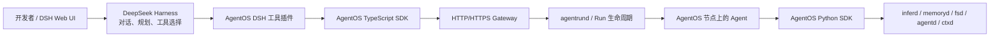

# DeepSeek Harness 接入 PeakVisionOS SDK

本文帮助开发者把 DeepSeek Harness（DSH）作为 Agent 的交互、规划和工具选择层，
把 AgentOS 作为端侧运行、资源治理和系统能力层。完成后，开发者可以在 DSH Web UI
中让模型查看 AgentOS 节点、创建受管 Run、查询运行状态并读取日志。

本文按 DeepSeek Harness `0.1.2-alpha.1`、官方仓库提交
`cd5ef8148158c3a752a658978873241fdf8e2bbc` 验证。DeepSeek Harness 当前仍是
Developer Preview，插件 API 可能发生破坏性变化，升级 DSH 后必须重新执行本文的验收步骤。

## 1. 接入后的系统关系



职责边界：

| 组件 | 负责 | 不负责 |
| --- | --- | --- |
| DeepSeek Harness | 会话、规划、工具选择、交互界面、插件组合 | AgentOS 资源隔离、系统升级和原语实现 |
| AgentOS TypeScript SDK | 远程控制面：Agent、Workspace、Task、Run、日志、事件 | 从开发电脑远程直连四大原语 |
| AgentOS 节点 | Agent 生命周期、权限、资源限制、本地推理、记忆和语义文件 | DSH 的对话界面和规划策略 |

当前推荐的是“控制面接入”：DSH 通过 TypeScript SDK 操作 AgentOS Run。不要让 DSH
插件绕过 SDK 访问 SQLite、daemon 私有 HTTP 接口或 Unix Socket 行协议。

## 2. 前置条件

- DeepSeek Harness 源码检出；官方插件教程目前要求从源码开发本地插件。
- Node.js `22.19+` 或官方当前支持版本，以及 Corepack/pnpm。
- 本机已克隆 `AgentOS-SDK`，并能完成 TypeScript SDK 构建。
- 一台已运行 AgentOS 控制面和至少一个 Agent 的 Ubuntu 节点。
- 如控制面启用鉴权，需要管理员提供短期 Token。

本文假设目录如下，实际路径可以不同：

```text
~/work/
├── AgentOS-SDK/
└── deepseek-harness/
```

## 3. 准备 AgentOS 连接

如果 AgentOS 控制面只监听 Ubuntu 节点的 `127.0.0.1:17680`，在开发电脑建立 SSH
隧道：

```bash
ssh -N -L 17680:127.0.0.1:17680 <ubuntu-user>@<AGENTOS_HOST>
```

另开一个 Terminal：

```bash
export AGENTOS_ENDPOINT=http://127.0.0.1:17680/api/v1
export AGENTOS_TOKEN='<管理员提供的控制面 Token>'

curl http://127.0.0.1:17680/api/v1/health
curl -H "Authorization: Bearer $AGENTOS_TOKEN" \
  http://127.0.0.1:17680/api/v1/agents
```

如果控制面没有启用 Token，可不设置 `AGENTOS_TOKEN`。生产环境使用 HTTPS/mTLS
Gateway，不要把无鉴权的控制面直接暴露到局域网或公网。

## 4. 构建 SDK 和 DeepSeek Harness

先构建本地 AgentOS TypeScript SDK：

```bash
cd ~/work/AgentOS-SDK/typescript
npm ci
npm run build
```

再准备 DeepSeek Harness：

```bash
cd ~/work/deepseek-harness
corepack enable
pnpm install
pnpm run build
```

把本地 SDK 链接到 DSH 工作区根目录：

```bash
pnpm add -Dw ~/work/AgentOS-SDK/typescript
```

PeakVisionOS SDK 正式发布到 NPM 后，可以改为：

```bash
pnpm add -Dw @peakvision/pvos-sdk
```

## 5. 创建 AgentOS 工具插件

在 DeepSeek Harness 仓库根目录创建：

```text
scratch-agentos-plugin/
├── cordis.yml
└── src/
    └── agentos-tools.ts
```

`src/agentos-tools.ts`：

```ts
import type { Context } from '@deepseek-ai/cordis'
import { defineTool } from '@deepseek-ai/dsh-tools'
import { PeakVisionOS } from '@peakvision/pvos-sdk'

export const name = 'agentos-tools'
export const inject = ['tools']

function renderJson(value: string) {
  return [{ type: 'text' as const, text: value }]
}

export function apply(ctx: Context) {
  const client = new PeakVisionOS({
    endpoint: process.env.PVOS_ENDPOINT,
    token: process.env.PVOS_TOKEN,
  })

  ctx.tools.register(defineTool({
    name: 'agentos_list_agents',
    description: 'List the Agents installed on the connected AgentOS node.',
    parameters: {},
    output: {
      schema: { type: 'string' },
      render: (_args, value) => renderJson(value),
    },
    async execute(_args, exec) {
      if (exec.signal.aborted) throw new Error('AgentOS request cancelled')
      return JSON.stringify(await client.agents())
    },
  }))

  ctx.tools.register(defineTool({
    name: 'agentos_start_run',
    description: 'Create a Workspace, Task and managed Run on AgentOS.',
    parameters: {
      agent: { type: 'string', required: true, description: 'Installed Agent name' },
      title: { type: 'string', required: true, description: 'Task title' },
      description: { type: 'string', description: 'Task details' },
    },
    output: {
      schema: { type: 'string' },
      render: (_args, value) => renderJson(value),
    },
    async execute(args, exec) {
      if (exec.signal.aborted) throw new Error('AgentOS request cancelled')
      const workspace = await client.createWorkspace(`DSH: ${args.title}`)
      const task = await client.createTask(
        workspace.workspace_id,
        args.title,
        args.description ?? '',
        args.agent,
      )
      const run = await client.createRun(
        args.agent,
        task.task_id,
        workspace.workspace_id,
        '',
        `dsh-${task.task_id}`,
      )
      return JSON.stringify({
        workspace_id: workspace.workspace_id,
        task_id: task.task_id,
        run_id: run.run_id,
        status: run.status,
      })
    },
  }))

  ctx.tools.register(defineTool({
    name: 'agentos_run_status',
    description: 'Read the current status of an AgentOS Run.',
    parameters: {
      run_id: { type: 'string', required: true, description: 'AgentOS Run id' },
    },
    output: {
      schema: { type: 'string' },
      render: (_args, value) => renderJson(value),
    },
    async execute(args, exec) {
      if (exec.signal.aborted) throw new Error('AgentOS request cancelled')
      return JSON.stringify(await client.run(args.run_id))
    },
  }))

  ctx.tools.register(defineTool({
    name: 'agentos_agent_logs',
    description: 'Read recent logs for an Agent installed on AgentOS.',
    parameters: {
      agent: { type: 'string', required: true, description: 'Installed Agent name' },
    },
    output: {
      schema: { type: 'string' },
      render: (_args, value) => renderJson(value),
    },
    async execute(args, exec) {
      if (exec.signal.aborted) throw new Error('AgentOS request cancelled')
      return JSON.stringify(await client.logs(args.agent))
    },
  }))
}
```

`cordis.yml` 中的插件路径必须是绝对路径：

```yaml
- insert:
    - id: agentos-tools
      name: '/absolute/path/to/deepseek-harness/scratch-agentos-plugin/src/agentos-tools.ts'
```

`AgentOS()` 自动读取 `AGENTOS_ENDPOINT` 和 `AGENTOS_TOKEN`。不要把 Token 写进
TypeScript、`cordis.yml` 或 Git 仓库。

## 6. 启动并验证

从 DeepSeek Harness 仓库根目录启动：

```bash
export AGENTOS_ENDPOINT=http://127.0.0.1:17680/api/v1
export AGENTOS_TOKEN='<管理员提供的控制面 Token>'

pnpm dsh web --patch ./scratch-agentos-plugin/cordis.yml
```

打开 `http://127.0.0.1:3080`，依次输入：

```text
调用 agentos_list_agents，列出 AgentOS 节点上可用的 Agent。

选择其中一个 Agent，调用 agentos_start_run 创建任务：
“输出当前节点状态，并给出一句运行建议”。返回 workspace_id、task_id 和 run_id。

使用返回的 run_id 调用 agentos_run_status，直到进入终态。

调用 agentos_agent_logs 读取刚才 Agent 的日志，并总结运行结果。
```

AgentOS Run 的稳定终态是：

```text
completed / failed / stopped / timeout / cancelled
```

首次验收必须保留四项证据：DSH 工具调用记录、`run_id`、AgentOS Run 终态和 Agent
日志。仅看到 DSH 回复文本不能证明 AgentOS Run 已成功执行。

## 7. 让 Run 调用端侧模型和系统原语

上面的 DSH 插件只负责创建和观察 Run。真正调用 `inferd`、`memoryd`、`fsd`、
`agentd` 和 `ctxd` 的代码，应放在部署到 AgentOS Ubuntu 节点的 Agent 中：

```python
import pvos

aos = pvos.PeakVisionOS(caller="deepseek-worker")

system = aos.system()
answer = aos.chat("根据当前节点状态给出一句运行建议")
aos.memory_write(f"节点状态：{system}")
aos.fs_put("deepseek-result.json", str(answer))

print({"system": system, "answer": answer})
```

对应 Manifest 只申请实际需要的能力：

```ini
name=deepseek-worker
exec=/usr/bin/python3 /etc/agent-os/agents/deepseek-worker/agent.py
primitives=agent,infer,memory,fs
memory_max=512M
cpu_quota=100%
autostart=no
restart=on-failure
sandbox=on
network=loopback
```

创建和安装 Agent 的完整流程见
[PeakVisionOS SDK 开发者快速开始](developer-quickstart.zh-CN.md#7-创建自己的-agent)。

## 8. 与 Python Harness Adapter v1 的关系

`pvos.PeakVisionOSHarnessBridge` 是 AgentOS 自己的稳定 Python Harness Adapter Contract，
其 `plan()` / `validate()` 接口不是 DeepSeek Harness 官方 TypeScript 插件 API。两者不能
直接互换：

- 官方 DeepSeek Harness 集成使用本页的 TypeScript 工具插件。
- Python Harness、自研规划器或离线评估使用 `AgentOSHarnessBridge`。
- 两条路径最终都应映射到稳定的 AgentOS 工具名、Run 状态和事件语义，不依赖 daemon
  私有协议。

后续如果 AgentOS 发布正式的 DSH Plugin 包，应由该包封装本页工具注册逻辑；业务 Agent
不应复制控制面协议实现。

## 9. 生产化要求

- 固定 DeepSeek Harness 版本或提交；不要无验证自动升级 Developer Preview。
- 把插件打成 DSH bundle，并通过 `dsh plugin --profile <name> add` 安装；生产环境不要
  长期依赖 `scratch-*` 路径。
- 使用 HTTPS/mTLS Gateway、短期 Token 和最小权限节点账户。
- Token 只通过环境变量或密钥管理服务注入。
- Manifest 使用最小原语、CPU、内存和网络权限。
- 对每次 Run 记录 `task_id`、`run_id`、终态、失败原因和日志位置。
- 对 DSH 插件、Agent 包和模型版本分别锁定版本，避免一次升级同时改变三层行为。
- DeepSeek Harness 官方明确说明其尚未经过安全审计，不应把 DSH 沙箱作为不可信任务的
  唯一安全边界；强隔离仍由 AgentOS 节点策略承担。

## 10. 当前限制

- AgentOS TypeScript SDK 当前只开放远程控制面，不能从 DSH 进程远程直接调用四大原语。
- TypeScript SDK 方法接受 `RequestOptions.signal`，DSH 取消时应把
  `AbortSignal` 传给对应 SDK 调用；SDK 自身 timeout 仍作为硬上限。
  示例会在请求前检查取消，但不能中断已经发出的 SDK 请求。
- DSH 工具输出暂以 JSON 字符串返回，以兼容当前 Developer Preview 的稳定标量输出模式；
  正式插件可在固定 DSH 版本后增加结构化对象 schema 和专用 UI 卡片。
- 本文不代表 DeepSeek 官方维护的 AgentOS 插件，也不改变两边项目各自的许可证和支持边界。

## 11. 常见问题

| 现象 | 排查方式 |
| --- | --- |
| DSH 启动时报找不到 `@peakvision/pvos-sdk` | 先构建 SDK，再在 DSH 根目录执行 `pnpm add -Dw <SDK 的 typescript 目录>` |
| 插件没有加载 | 检查 `cordis.yml` 是否使用绝对插件路径，并执行 `pnpm dsh web --patch ...` |
| `agentos_list_agents` 返回连接失败 | 检查 SSH 隧道、`AGENTOS_ENDPOINT` 和节点 `agentosd` |
| HTTP 401 | Token 缺失、错误或已经轮换 |
| Agent 列表为空 | 节点还没有安装有效的 Agent Manifest |
| Run 一直是 `running` | 调用 `agentos_run_status`，同时查看 Agent 日志和 `agentrund` 状态 |
| DSH 能运行但不能调用本地推理 | 推理原语只能由 AgentOS 节点上的 Agent 通过 Unix Socket 调用 |

## 12. 参考资料

- [DeepSeek Harness 官方仓库](https://github.com/deepseek-ai/deepseek-harness)
- [DeepSeek Harness 第一个插件](https://github.com/deepseek-ai/deepseek-harness/blob/master/docs/user/develop/basic/index.zh.md)
- [DeepSeek Harness 工具开发](https://github.com/deepseek-ai/deepseek-harness/blob/master/docs/user/develop/basic/tool.md)
- [DeepSeek Harness 插件打包与安装](https://github.com/deepseek-ai/deepseek-harness/blob/master/docs/user/develop/basic/publish.zh.md)
- [DeepSeek Harness 安全说明](https://github.com/deepseek-ai/deepseek-harness/blob/master/SAFETY.md)
- [AgentOS Harness Adapter v1](harness-adapter-v1.md)
- [AgentOS 控制面 HTTP API](control-plane-api.md)
